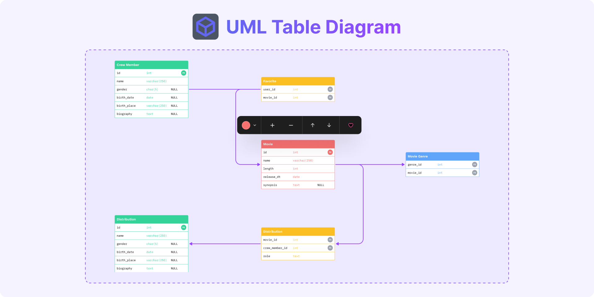

# FigJam UML Table

This widget is to create a UML table (class) diagram for FigJam or Figma. It is inspired by the [UML Diagrams template](https://www.figma.com/community/file/999008812984283340).

## More Feature, more custom!

We're actively listening to and prioritizing feedback so this list may change. Currently list is what we plan to support in this wedget.

### Currently Supported

- ✅ Optimized Property Menu
- ✅ A total of 15 theme colors
- ✅ Add and Remove column friendly
- ✅ Move up or down a column
- ✅ Each column can have a name, a type, a marker and a key ("PK" and "FK" have a custom color to help to recognize them).

### Future Extensions

- 🗄️ Add an emoji icon before header title
- 🗄️ Generate table from code scripts
- 🗄️ Copy table markup language quickly
- 🗄️ Connector every rows to other table or rows, it is too head to realize, I'm so sorry...

## Feedback

You can use [GitHub Issues](https://github.com/logeast/figjam-uml/issues) to share your ideas, feedback or bugs on Github.

## LICENSE

The project is open-source under [MIT license](./LICENSE). This project is forked from `arthur-fontaine/figtable` and you can find the code here: https://github.com/logeast/figjam-uml.
